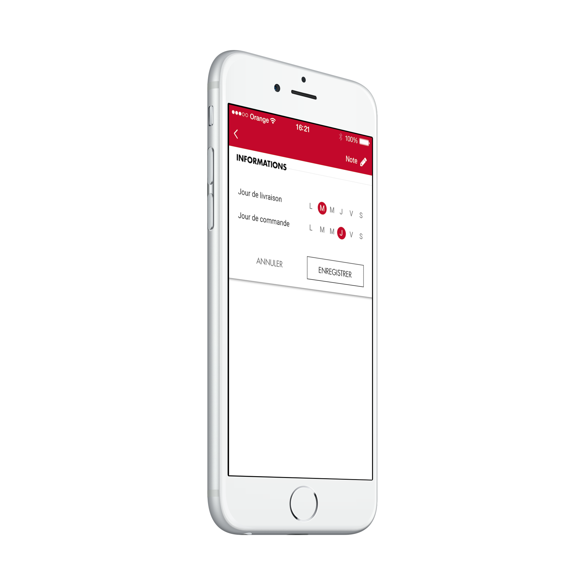
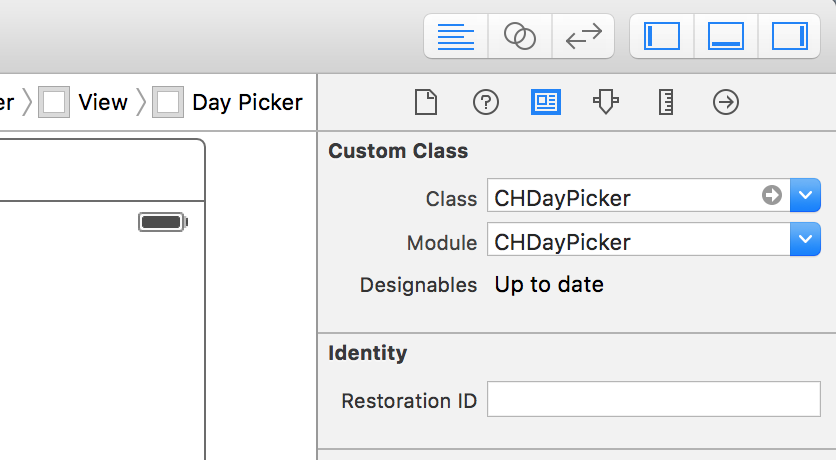
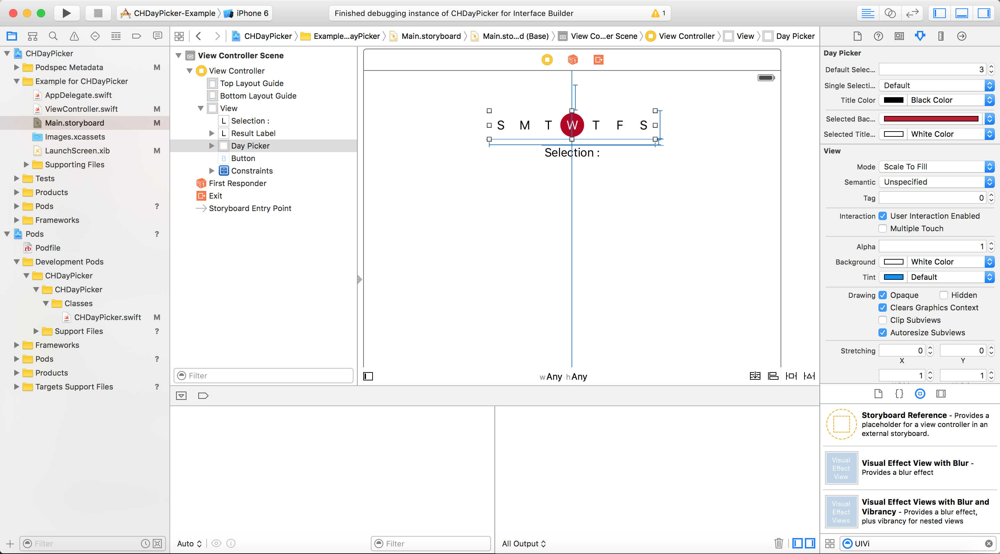

# CHDayPicker

[](https://travis-ci.org/Charles HARROCH/CHDayPicker)
[](http://cocoapods.org/pods/CHDayPicker)
[](http://cocoapods.org/pods/CHDayPicker)
[](http://cocoapods.org/pods/CHDayPicker)



## Example

To run the example project, clone the repo, and run `pod install` from the Example directory first.

## Installation

CHDayPicker is available through [CocoaPods](http://cocoapods.org). To install
it, simply add the following line to your Podfile:

```ruby
pod "CHDayPicker"
```

## Usage

In interface builder, drag UIView in your controller and set the class name to CHDayPicker




## Customisation (IBDesignable)



* Item title and number
* Multiple and unique Selection
* Title color (selected and unselected state)
* Selected background Color

## Delegate - CHDayPickerDelegate

```swift
 func didSelectDay(position: Int, label: String, selected : Bool)
```

## Author

Charles HARROCH, charles.harroch@gmail.com

## License

CHDayPicker is available under the MIT license. See the LICENSE file for more info.
